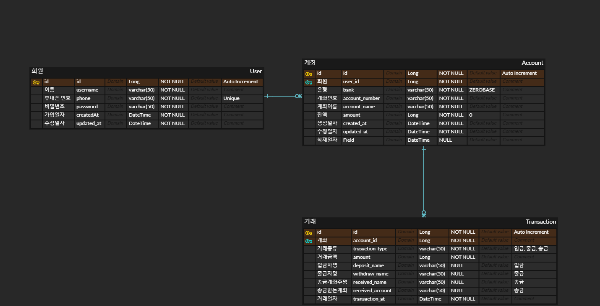

# 📖 핀테크(Fin-Tech) 프로젝트

## ⚙ 기술 스택

 
   
   
  
  

## 📆 개발 기간
- 2024.02.19 ~ 2024.03.25

## 1️⃣ ERD

## 2️⃣ 기능 사항

### 회원 가입
- [ ] 이름, 휴대폰번호, 비밀번호를 이용하여 회원가입
- [ ] 휴대폰번호 중복 불가

### 로그인
- [ ] 휴대폰 번호, 비밀번호를 이용한 로그인
- [ ] 모든 기능은 로그인을 후 사용가능

### 계좌
- [ ] 계좌 생성, 조회, 삭제(계좌 생성은 zerobase은행의 계좌만 가능)
- [ ] 모든 기능은 로그인 후 사용 가능
- [ ] 계좌 목록 조회(계좌번호, 잔액 표시)

### 타 은행 계좌
- [ ] 은행명, 소유주명, 계좌번호를 이용해 등록(계좌 번호 중복 x)

### 계좌 검색
- [ ] 계좌 번호와 은행명을 이용한 계좌 조회(등록 되있거나 생성된 계좌만 조회 가능)

### 입출금
- [ ] 입금 기능(입금 시 입금자명 입력)
- [ ] 자신의 계좌에 있는 금액 출금(출금 시 출금자명 입력)

### 송금
- [ ] 본인 계좌의 잔액 내에서 송금 기능

### 입출금 내역 조회
- [ ] 본인의 계좌 입출금 내역 조회 기능(거래 금액, 거래 대상, 거래 일시 확인)
